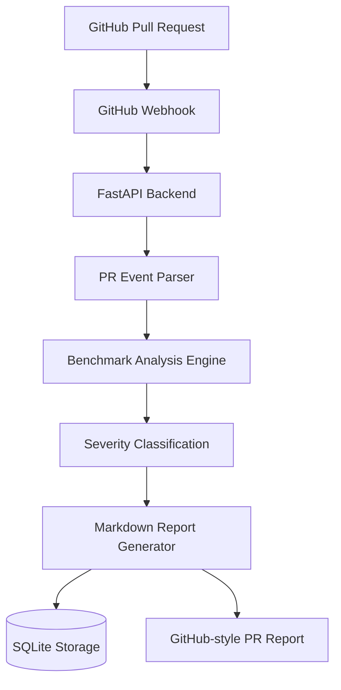

# Benchmark Guardian

Performance regression detection platform for GitHub pull requests.

Benchmark Guardian analyzes benchmark results, detects regressions, classifies severity, and generates GitHub-style performance reports for developer workflows and ML infrastructure systems.

---

## Features

- GitHub App webhook integration
- Pull request event parsing
- Benchmark regression detection
- Severity classification
- GitHub-style markdown reports
- SQLite persistence layer
- Typed FastAPI APIs
- Repository abstraction layer
- Automated testing
- Secure webhook signature verification

---

## Architecture



---

## Example Benchmark Report

```markdown
# Benchmark Guardian Report

## 🔴 Status: Regression detected

| Metric | Value |
|---|---|
| Baseline | `100.0` |
| Current | `120.0` |
| Change | `20.00%` |
| Severity | `high` |
| Regression | `True` |
```

---

## API Example

### Analyze Benchmark

```bash
curl -X POST http://127.0.0.1:8000/analyze \
-H "Content-Type: application/json" \
-d '{"baseline":100,"current":120}'
```

### Response

```json
{
  "analysis": {
    "baseline": 100.0,
    "current": 120.0,
    "change_percent": 20.0,
    "regression": true,
    "severity": "high"
  },
  "report": "# Benchmark Guardian Report ..."
}
```

---

## Tech Stack

- Python
- FastAPI
- SQLite
- Pytest
- GitHub Webhooks
- Pydantic

---

## Local Development

### Install dependencies

```bash
pip install -r requirements.txt
```

### Run server

```bash
uvicorn app.main:app --reload
```

### Run tests

```bash
pytest
```

---

## Environment Variables

Create `.env`:

```env
GITHUB_WEBHOOK_SECRET=your-webhook-secret
```

---

## Project Structure

```text
app/
├── db/
├── github/
├── models/
├── repositories/
├── security/
├── services/

tests/
```

---

## Vision

Benchmark Guardian aims to become a performance intelligence platform for ML systems and developer infrastructure.

Future roadmap:
- Multi-metric benchmark analysis
- GPU memory regression detection
- Throughput analysis
- Distributed training metrics
- PR comment automation
- Benchmark dashboards
- Scaling efficiency analysis
- CI benchmark integrations

---

## License

MIT