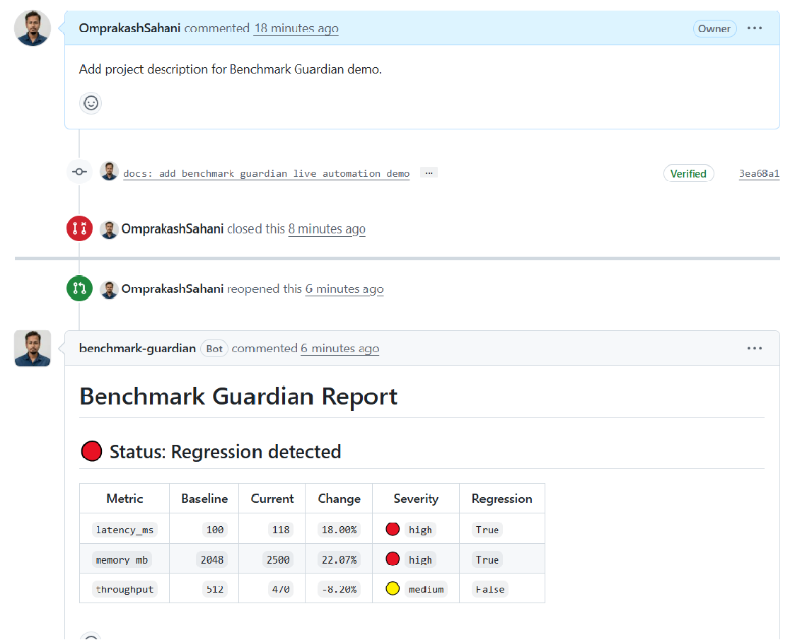
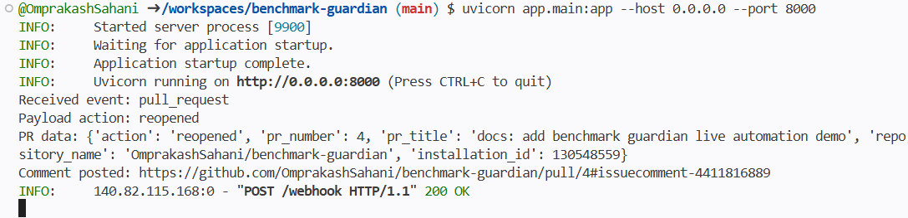
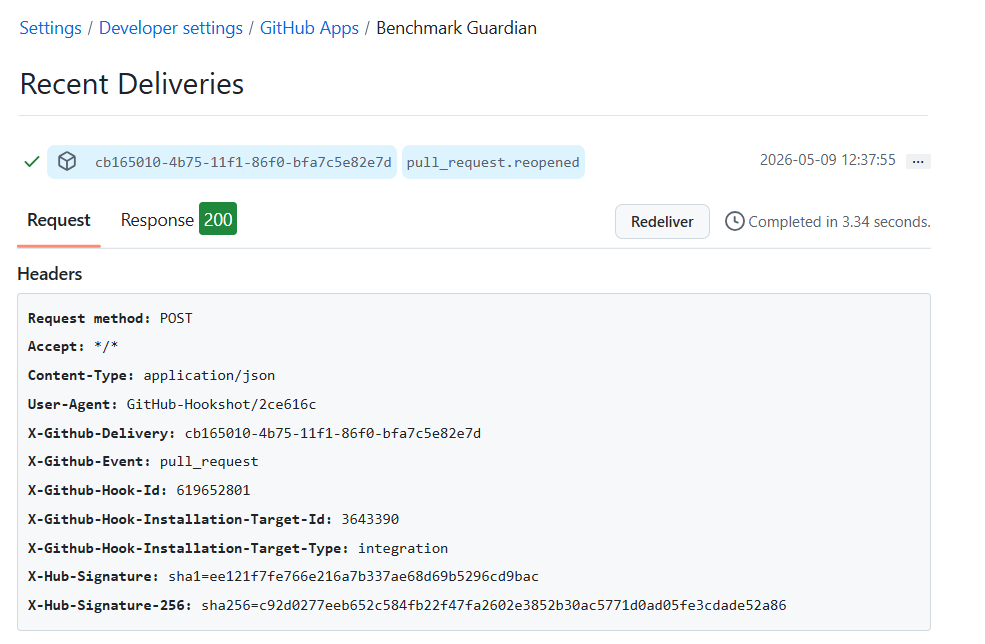

<div align="center">

# Benchmark Guardian
### Automated benchmark regression detection for GitHub pull requests and ML infrastructure systems.


Benchmark Guardian automatically analyzes benchmark regressions, classifies severity, and posts rich multi-metric performance reports directly into GitHub pull requests.

</div>

---

## Overview

Benchmark Guardian is a developer infrastructure platform for automated benchmark regression detection in GitHub pull requests.

The system analyzes benchmark results, detects performance regressions across multiple metrics, classifies severity levels, and posts automated reports directly into pull request discussions.

It is designed for performance-critical systems such as:

- ML infrastructure
- Distributed training systems
- Backend services
- Optimization pipelines
- Developer tooling platforms

---

## Problem Statement

Performance regressions are often difficult to detect during code review workflows.

A pull request may:

- Increase latency
- Increase memory usage
- Reduce throughput
- Degrade scaling efficiency
- Introduce infrastructure bottlenecks

without immediately failing tests.

In large-scale ML systems and infrastructure platforms, unnoticed regressions can significantly increase:

- Compute cost
- GPU utilization
- Training time
- Operational complexity

Benchmark Guardian automates regression detection directly inside GitHub pull requests through:

- Webhook-driven analysis
- Benchmark comparison
- Severity classification
- Automated developer feedback

---


## Architecture


---

## Live GitHub App Demo

### Automated PR Analysis Comment



Benchmark Guardian automatically:

- Receives GitHub webhook events
- Authenticates as a GitHub App
- Analyzes benchmark regressions
- Generates multi-metric reports
- Posts automated PR comments

---

### Live Webhook Processing



The backend processes:

- GitHub webhook events
- Pull request metadata
- Benchmark analysis workflows
- Automated comment publishing

---

### GitHub Webhook Deliveries



GitHub successfully delivers real webhook events to Benchmark Guardian through the public FastAPI backend.

---

## Features

- Real GitHub App integration
- Secure webhook signature verification
- Automated PR comment publishing
- Multi-metric benchmark analysis
- Latency regression detection
- Memory regression detection
- Throughput analysis
- Severity classification
- SQLite persistence layer
- Typed FastAPI APIs
- Automated testing + API mocking
- Event-driven backend architecture

---

## Example Benchmark Report

```markdown
# Benchmark Guardian Report

## 🔴 Status: Regression detected

| Metric | Baseline | Current | Change | Severity | Regression |
|---|---:|---:|---:|---|---|
| latency_ms | 100 | 118 | +18% | 🔴 high | True |
| memory_mb | 2048 | 2500 | +22% | 🔴 high | True |
| throughput | 512 | 470 | -8% | 🟡 medium | False |
```

---

## API Example

### Analyze Benchmark Metrics

```bash
curl -X POST http://127.0.0.1:8000/analyze \
-H "Content-Type: application/json" \
-d '{"baseline":100,"current":120}'
```

---

## Tech Stack

- Python
- FastAPI
- SQLite
- Pytest
- GitHub Apps
- GitHub Webhooks
- Pydantic
- JWT Authentication

---

## Local Development

### Install dependencies

```bash
pip install -r requirements.txt
```

### Run server

```bash
uvicorn app.main:app --reload
```

### Run tests

```bash
pytest
```

---

## Environment Variables

Create `.env`:

```env
GITHUB_WEBHOOK_SECRET=your-webhook-secret
GITHUB_APP_ID=your-app-id
```

---

## Project Structure

```text
app/
├── analysis/
├── db/
├── github/
├── models/
├── repositories/
├── security/
└── services/

tests/
assets/
```

---

## Vision

Benchmark Guardian aims to become a performance intelligence platform for ML systems and developer infrastructure.

Future roadmap:

- GPU memory regression analysis
- Distributed training metrics
- Scaling efficiency analysis
- CI benchmark ingestion
- Benchmark dashboards
- Historical trend analysis
- Benchmark artifact uploads
- ML systems observability

---

## License

MIT
